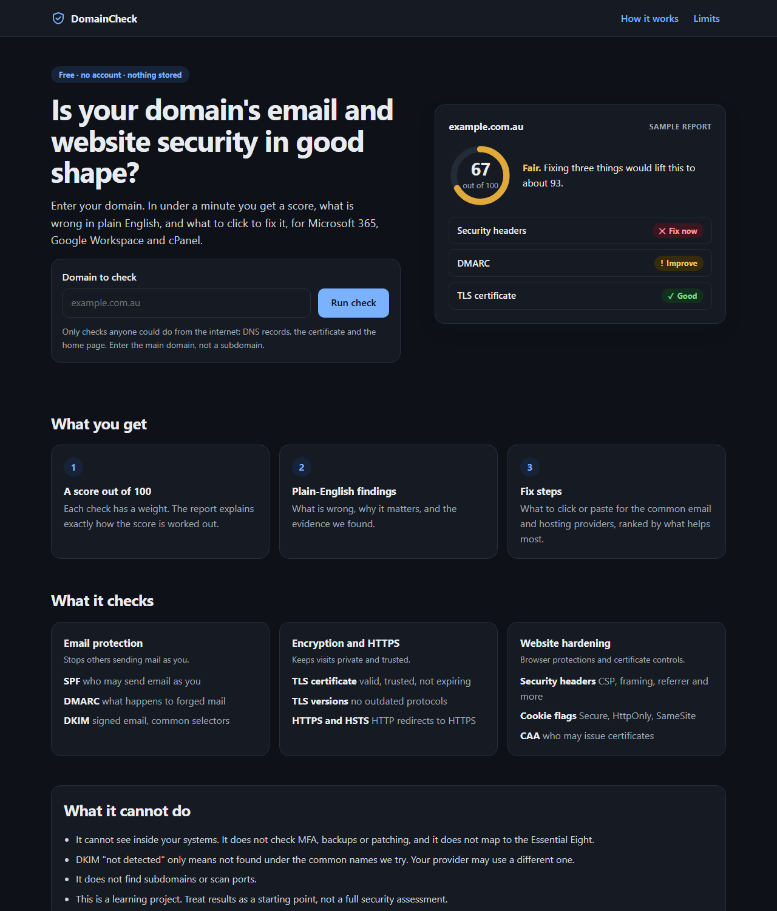
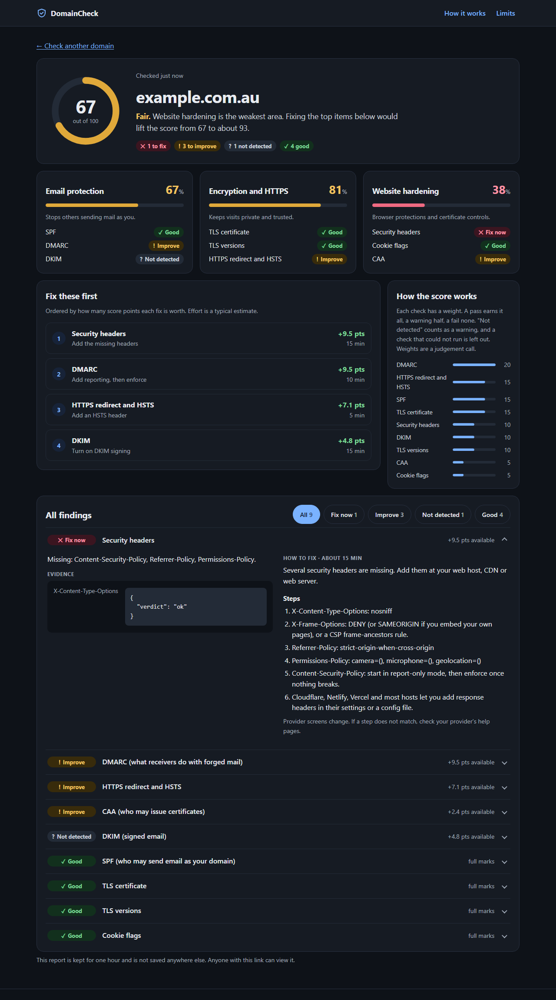
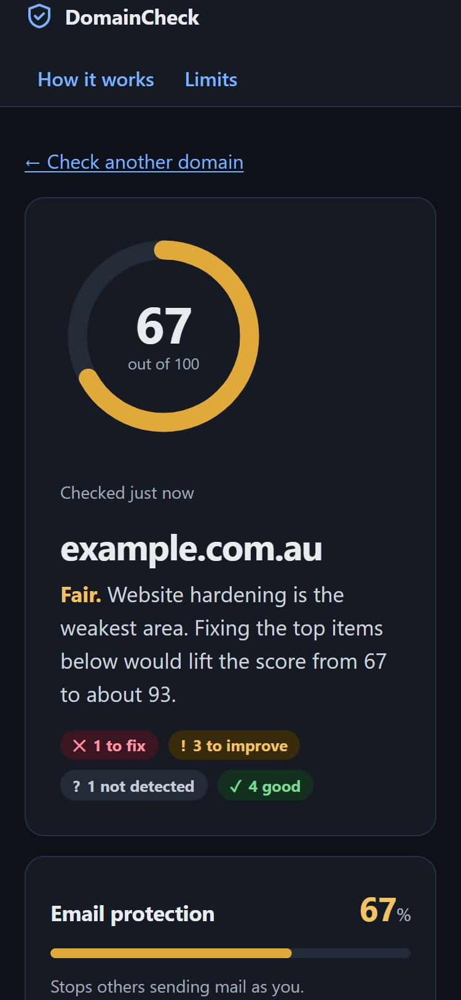

# DomainCheck

Enter a domain and get a plain-English report on its email security and basic web hygiene, with a score and fix steps for Microsoft 365, Google Workspace and cPanel.

No accounts, no database. Reports live in memory for one hour and then disappear.

This is a learning project. Treat the results as a starting point, not a security assessment.

## Screenshots

Taken from the demo server with sample data (`scripts/dev_demo.py`), not from a live scan. They show the dark theme; the app follows your system light or dark setting.

**Landing page**



**Report dashboard.** A score, three area cards, the fixes ranked by score points gained, and every finding with evidence and fix steps. The chips filter the list and each row expands.



**PDF export.** Each finished report has a Download PDF button (`/r/<id>/report.pdf`). The PDF is built on the server with ReportLab and holds the same score, areas, ranked fixes, evidence and fix steps. See [docs/sample-report.pdf](docs/sample-report.pdf), which uses the same sample data as the screenshots.

**Report on a phone**



## What it checks

| # | Check | What it looks at |
|---|---|---|
| 1 | SPF | One record, ends in `-all` or `~all`, stays within the 10 DNS lookup limit |
| 2 | DMARC | Record exists, policy level (none, quarantine, reject), reporting address |
| 3 | DKIM | A short list of common selector names; key size (under 1024 bits fails, 1024 warns, 2048 and up passes) |
| 4 | TLS certificate | Valid, trusted, matching name, complete chain, days until expiry |
| 5 | TLS versions | Which of TLS 1.0 to 1.3 the server accepts |
| 6 | HTTPS and HSTS | HTTP redirects to HTTPS, HSTS present with a long lifetime |
| 7 | Security headers | CSP, X-Frame-Options, X-Content-Type-Options, Referrer-Policy, Permissions-Policy, including weak values |
| 8 | Cookie flags | Secure, HttpOnly, SameSite on the home page response |
| 9 | CAA | Which authorities may issue certificates |
| 10 | Sensitive files | A fixed list such as `/.git/HEAD` and `/.env`. **Off by default**, see below |

Each finding is pass, warn, fail, not detected or could not check. Warn, fail and not-detected findings come with fix steps.

## What it cannot do

- It cannot see inside your systems. It does not check MFA, backups or patching, and it makes no claim about the Essential Eight.
- DKIM "not detected" only means not found under the names it tries. Selectors cannot be listed passively.
- It does not find subdomains or scan ports. It accepts a main domain such as `example.com.au`, not a subdomain.
- A domain that sends no email still gets SPF and DMARC findings. The report does not yet say whether the domain uses email at all.
- Results are a snapshot from passive checks.

## Running it

Requires Python 3.12.

```bash
python -m venv .venv
.venv/Scripts/activate        # Windows; use source .venv/bin/activate elsewhere
pip install -e ".[dev]"
uvicorn app.main:create_app --factory
```

Open http://127.0.0.1:8000. For local development over plain HTTP, set `DOMAINCHECK_SECURE_COOKIES=false` and `DOMAINCHECK_HSTS=false`, otherwise the browser will not send the CSRF cookie back.

A local run can scan any public domain using your machine's normal DNS and internet connection. The default limits are 10 scans per hour per IP and 3 per hour per domain; raise them with `DOMAINCHECK_LIMIT_IP_PER_HOUR` and `DOMAINCHECK_LIMIT_DOMAIN_PER_HOUR` while testing. Targets on private networks, `localhost` and IP addresses are refused on purpose.

On Windows, `powershell -ExecutionPolicy Bypass -File scripts\run_local.ps1` does all of this: it creates the virtual environment on first run, sets the local settings and starts the server.

To work on the pages without network access, run `python scripts/dev_demo.py`. It uses the real app with canned results.

With Docker:

```bash
docker build -t domaincheck .
docker run -p 8000:8000 -e DOMAINCHECK_SECRET_KEY=change-me domaincheck
```

### Settings

Set as environment variables or in a `.env` file.

| Variable | Default | Meaning |
|---|---|---|
| `DOMAINCHECK_SECRET_KEY` | random per start | Signs the CSRF cookie |
| `DOMAINCHECK_SECURE_COOKIES` | `true` | Send the cookie over HTTPS only |
| `DOMAINCHECK_HSTS` | `true` | Send the HSTS header |
| `DOMAINCHECK_TRUST_FORWARDED_FOR` | `false` | Use the last `X-Forwarded-For` entry as the client IP. Only set this behind exactly one trusted proxy |
| `DOMAINCHECK_ENABLE_PATH_CHECK` | `false` | Turn on check 10 |
| `DOMAINCHECK_LIMIT_IP_PER_HOUR` | `10` | Scans per IP per hour |
| `DOMAINCHECK_LIMIT_DOMAIN_PER_HOUR` | `3` | Scans per target domain per hour |
| `DOMAINCHECK_LIMIT_GLOBAL_PER_HOUR` | `120` | Scans per hour in total |

## How it is built

Python, FastAPI, server-rendered Jinja templates and a small stylesheet. The only script is a same-origin file for copy buttons.

```
app/
  checks/     one module per check, plus the engine that runs them in a time budget
  dns/        the only code that makes DNS queries
  fetcher/    the only code that makes HTTP or TLS connections
  scoring/    weighted score
  fixes/      fix steps as JSON data files
  scanning/   background job runner and the in-memory result store
  domains/    domain input validation
  web/        routes, templates, static files, rate limits, CSRF, security headers
tests/        unit, integration and security tests; no test touches the real internet
```

Every check takes a domain and returns a finding. No check opens its own sockets. DNS goes through the resolver wrapper and HTTP and TLS go through the safe fetcher.

### Scoring

Pass earns full weight, warn half, fail none. "Not detected" counts as a warning. "Could not check" is left out of the score. Weights are a judgement call and live in `app/scoring/score.py`.

The report also works out how many score points each fix is worth (on the same 0 to 100 scale), ranks the fixes by that, and projects the score after the top three. The effort shown next to each fix ("10 min") is a typical estimate stored with the fix steps in `app/fixes/`. Checks are grouped into three areas (email, encryption, website hardening), each with its own percentage.

## Security design

The app fetches whatever domain a visitor types, so the fetcher is the part that matters most.

- **Address checks.** The name is resolved first, then every address is checked against blocked ranges (private, loopback, link-local, cloud metadata, carrier-grade NAT, IPv4-mapped and embedded IPv6 forms). If any address is blocked, the fetch is refused.
- **IP pinning.** The connection goes to the address that was checked, with the original hostname sent as the Host header and TLS name. A DNS answer that changes between check and connect cannot redirect the request.
- **Redirects.** Each redirect target goes through the same checks, and redirects are capped at five.
- **Limits.** Only http and https on ports 80 and 443. IP literals and URLs with credentials are refused. Five seconds per request, a 1 MB body cap, and a total time budget.
- **Input.** Domains are validated on the server: no IPs, internal names, public suffixes, shared hosting suffixes or subdomains.
- **Abuse limits.** Per-IP, per-domain and global rate limits, and a cap on queued scans.
- **Web layer.** CSRF token on the scan form, a strict Content-Security-Policy with no inline scripts or styles, and the usual security headers. Output is escaped.
- **Privacy.** No accounts. Nothing is written to disk, and cookie values and response bodies from targets are never stored. The app serves a plain-language privacy page at `/privacy` and a checklist on the landing page. Tests in `tests/integration/test_privacy.py` check each claim against the real behaviour: one cookie only, nothing loaded from other sites, no browser storage, nothing written to disk, and the one-hour retention. The Docker image turns off the server's access log so report links are not logged by the app, but a hosting platform may still keep its own logs.

Known weaknesses, accepted for a learning project:

- Rate limits are per process and per IP, so they reset on restart and are easy to evade.
- Anyone can scan any domain, and anyone with a report link can read it.
- Check 10 sends probing requests for sensitive files. Because the app no longer proves ownership, it is off by default. Only enable it for domains you own.

The app has no accounts and does not ask you to prove you own a domain. That keeps it simple and keeps nothing about you, at the cost of weaker abuse protection.

## Tests

```bash
pytest
ruff check .
bandit -r app -c pyproject.toml
pip-audit
```

The tests that matter most for the security design are in `tests/security/`: internal and metadata targets, redirects to internal addresses, DNS rebinding between checks, oversized and slow responses, and TLS probing on the same address rules. `tests/integration/test_real_tls.py` runs the real TLS code against a local server. CI runs the same four commands (`.github/workflows/ci.yml`).

## Similar tools

- [NCSC MailCheck](https://github.com/ukncsc/MailCheck.Public): large-scale email security monitoring for UK public sector domains.
- [DMarcCheck](https://dmarc.mx): DMARC, SPF, DKIM, BIMI and MTA-STS analyser, free and self-hostable.
- [AllowScanner](https://github.com/0xgetz/allowScanner): async scanner with header, TLS and DNS checks.
- [HTTP Headers Scanner](https://github.com/CarterPerez-dev/Cybersecurity-Projects/tree/main/PROJECTS/foundations/http-headers-scanner): grades security headers only.

DomainCheck covers email and web basics in one report for non-experts, puts fix steps for common providers next to each finding, and routes every outbound request through one safe fetcher.

## Status

Working and tested against fake DNS, fake web servers and a local TLS server, and run once against a real domain. Not yet done: deployment.
